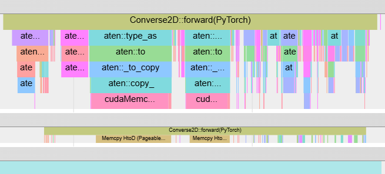

### Pytorch Analysis



**Bottleneck**

- p2o
- upsample

### Kernel Registry

---

**Kernel Tree**

```
├---v1 Translation from python to CPP
├---v2 Add FB/F2B cache & broadcast replace repeat
├---v3 splits→permute→view→mean to block mean CUDA kernel
├---v4 STy s-fold upsampler CUDA kernel
	├---v5 Larger batched FFT CUDA kernel
	├---v6 Eliminate redundant calculations of conj/abs/pow(2)
	├---v7 R2C/C2R (Real FFT) replaces C2C
```

**Tested Device**

- NVIDIA RTX 2080ti
- NVIDIA RTX 4090
- NVIDIA RTX 5060ti 16g

**v7** fastest

We highly recommend you to run `test/test_speed.py` first to choose the most suitable backend for GPU.

**Installation**

```python
cd ./Converse2D
# Remember to choose the wanted kernel version
pip install . --no-build-isolation --config-settings=--variant=v7
```

**Usage**

```python
import torch
import torch_converse2d

out = torch.ops.converse2d.forward(x, x0, weight, bias, scale, eps)
print(torch.ops.converse2d)
```

**TODO**

- [ ] Temporary Tensor Reuse and In-Place Writing
- [X] Larger batched FFT(v5) **Note: not very useful**
- [X] Eliminate redundant calculations of `conj/abs/pow(2)` (v6) *Note: not very useful**
- [ ] The minimal necessary policy for `contiguous()`
- [X] R2C/C2R (Real FFT) replaces C2C (v7) **(Optional)**
- [ ] Mixed precision **(Optional)**
- [ ] Adaptive padding **(Optional)**
