# [Reverse Convolution and Its Application to Image Restoration](https://arxiv.org/pdf/2003.10428.pdf)

[Xuhong Huang*](https://csgeekhuang.github.io/), [Shiqi Liu*](https://github.com/Stella-67), [Kai Zhang†](https://cszn.github.io/), Ying Tai, Jian Yang, Hui Zeng, [Lei Zhang](http://www4.comp.polyu.edu.hk/~cslzhang/)

Nanjing University, China

___________

* [Motivation](#motivation)
* [Method](#method)
* [Models](#models)
* [Codes](#codes)
* [PSNR results](#psnr-results)
* [Visual results of Converse-DnCNN](#visual-results-of-converse-dncnn)
* [Visual results of Converse-SRResNet](#visual-results-of-converse-srresnet)
* [Visual results of ConverseNet](#visual-results-of-conversenet)
* [Visual results of Converse-USRNet](#visual-results-of-converse-usrnet)

Motivation
----------
Convolution and transposed convolution (often referred to as deconvolution) are fundamental operations in deep neural networks. Convolution is commonly used for feature extraction and spatial downsampling. In contrast, transposed convolution is used to upsample spatial dimensions. Due to this functional relationship, transposed convolution is sometimes described in the literature as a reverse convolution operator. However, it is not the mathematical inverse of convolution. Instead, it performs upsampling by inserting zeros between input elements, followed by a standard convolution. While this interpretation is widely accepted, implementing a reverse convolution operator has received little attention. Notably, popular deep learning frameworks such as PyTorch do not provide native support for such an operator.

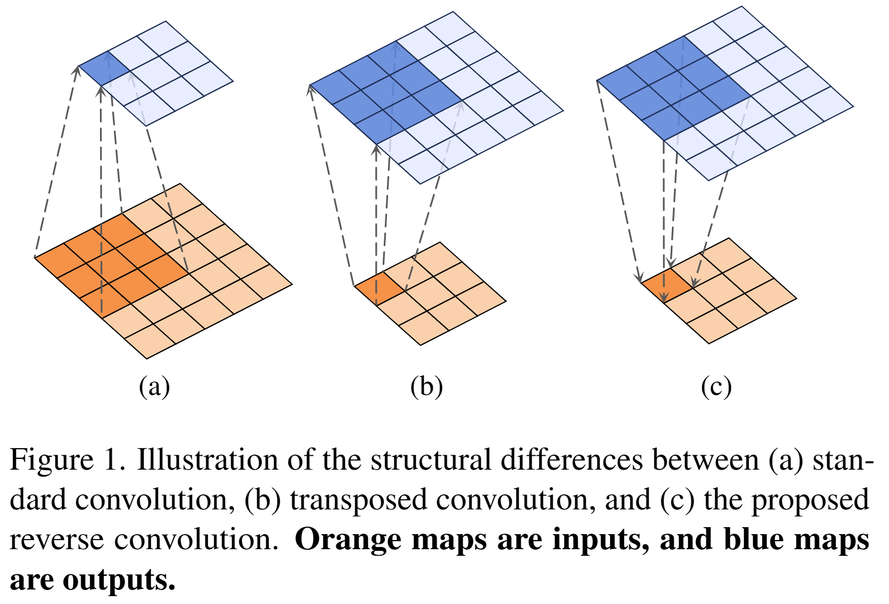 

Method
----------
- We propose a novel depthwise reverse convolution operator as a first-step exploration to effectively reverse the depthwise convolution by formulating and solving a regularized least-squares optimization problem. We thoroughly investigate its kernel initialization, padding strategies, and other critical aspects to ensure its effective implementation.

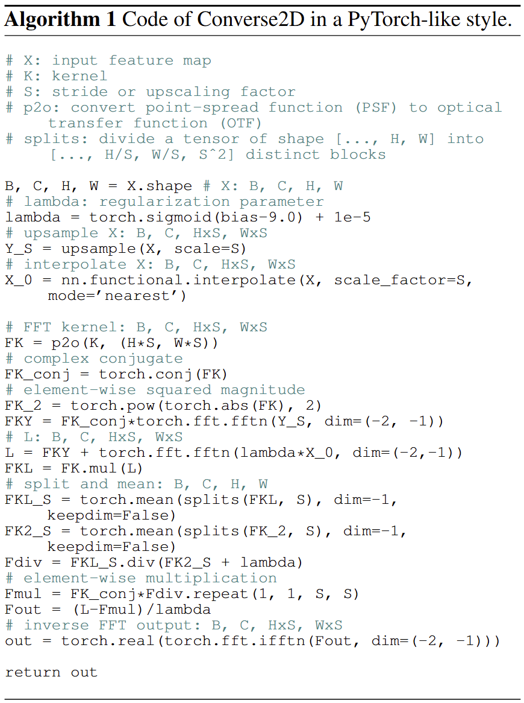 

<!-- $$
\mathbf{Y} = (\mathbf{X} \otimes \mathbf{K})\downarrow_{s}.
$$

$$
\mathbf{X} = \mathcal{F}(\mathbf{Y}, \mathbf{K}, s).
$$

$$
\mathbf{X}^\ast = \arg\min_{\mathbf{X}} \left\| \mathbf{Y} - \left( \mathbf{X} \otimes \mathbf{K} \right) \downarrow_{s} \right\|_F^2 + \lambda \left\| \mathbf{X} - \mathbf{X}_0 \right\|_F^2,
$$

$$
\mathbf{X}^\ast = \arg\min_{\mathbf{X}} \left\| \mathbf{Y} - \left( \mathbf{X} \otimes \mathbf{K} \right) \downarrow_{s} \right\|_F^2
$$

$$
\mathbf{X}^{*} = \mathbf{F}^{-1}\!\left(\frac{1}{\lambda}\Big(\mathbf{L} - \overline{\mathbf{F}_K} \odot_{s}\frac{(\mathbf{F}_K\mathbf{L})\Downarrow_{{s}} }{|\mathbf{F}_K|^2\Downarrow_{{s}} +\lambda}\Big)\right)
$$ -->
- Building upon this reverse convolution operator, we integrate it with layer normalization, 1x1 convolution, and GELU activation to form a reverse convolution block, similar to a Transformer block.

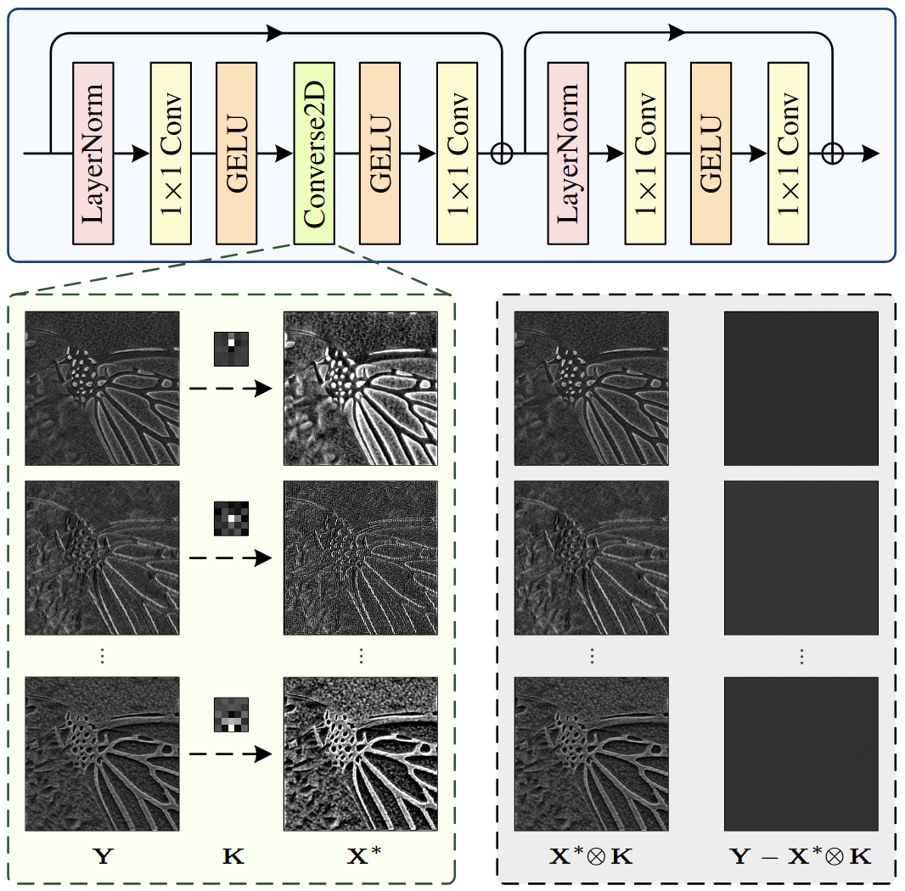 

Models
----------

|Model|# params|
|---|:---:|
|[Converse-DnCNN](model_zoo/converse_dncnn.pth)     | 734,913 |
|[Converse-SRResNet](model_zoo/converse_srresnet.pth)     | 694,208 |
|[ConverseNet](model_zoo/conversenet.pth)     | 243,267 |
|[Converse-USRNet](model_zoo/converse_usrnet.pth)     | 307,091 |

Codes
----------

* [main_test_converse_dncnn.py](main_test_converse_dncnn.py):  _Code to denoise images by Converse-DnCNN_
* [main_test_converse_srresnet.py](main_test_converse_srresnet.py):  _Code to super-resolve LR images by Converse-SRResNet_
* [main_test_converse_usrnet.py](main_test_converse_usrnet.py):  _Code to super-resolve LR images by Converse-USRNet_

PSNR results
----------

Run [main_test_converse_dncnn.py](main_test_converse_dncnn.py) to produce the following results.

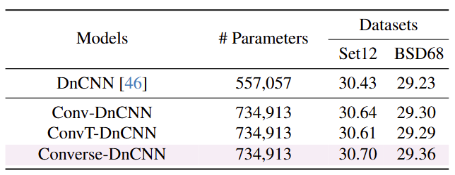  
The table shows the number of parameters and average PSNR(dB) results of different models for Gaussian denoising with noise level 25 on Set12 and BSD68 datasets.

Run [main_test_converse_srresnet.py](main_test_converse_srresnet.py) to produce the following results.

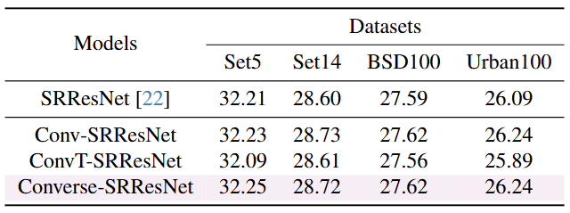  
The table shows the average PSNR(dB) results of different variants of SRResNet for super-resolution with scale factor 4.

Run [main_test_converse_usrnet.py](main_test_converse_usrnet.py) to produce the following results.

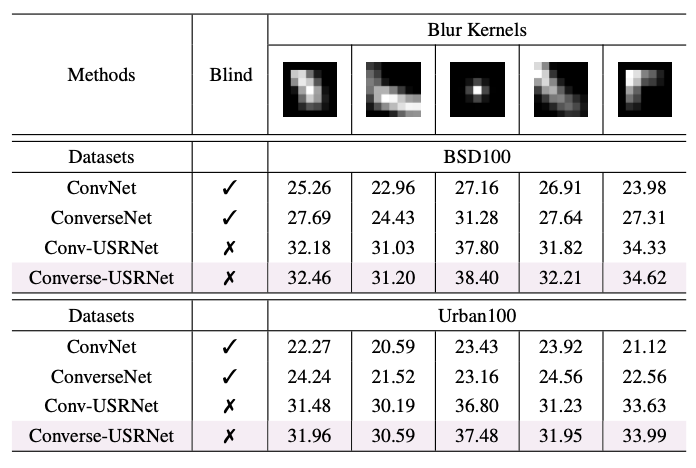  
The table shows the average PSNR(dB) results of different methods on Set5, Set14, BSD100 and Urban100 datasets.

Visual results of Converse-DnCNN
----------

|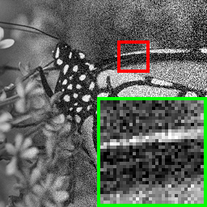 |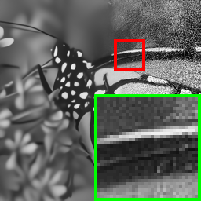|
|:---:|:---:|
|<i>Image with noise level uniformly ranging from 0 to 50</i>|<i>Denoising result by Converse-DnCNN</i>|

Visual results of Converse-SRResNet
----------

|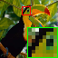 |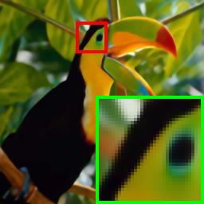|
|:---:|:---:|
|<i>LR image with scale factors 2</i>|<i>Super-resolution result by Converse-SRResNet</i>|

Visual results of ConverseNet
----------

|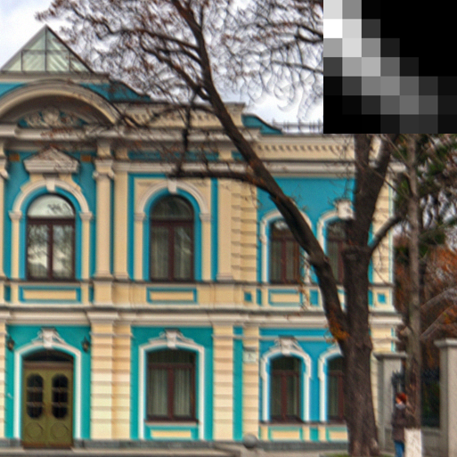 |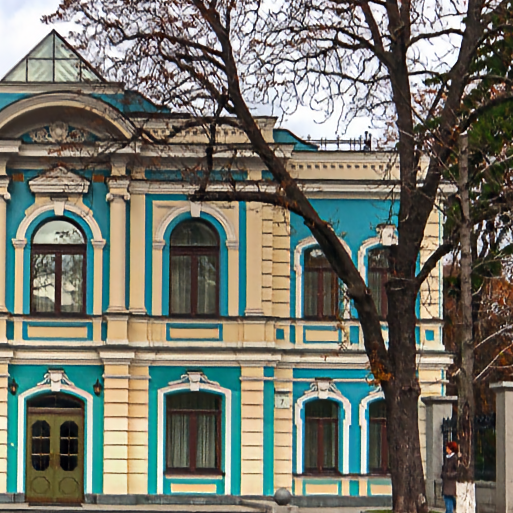|
|:---:|:---:|
|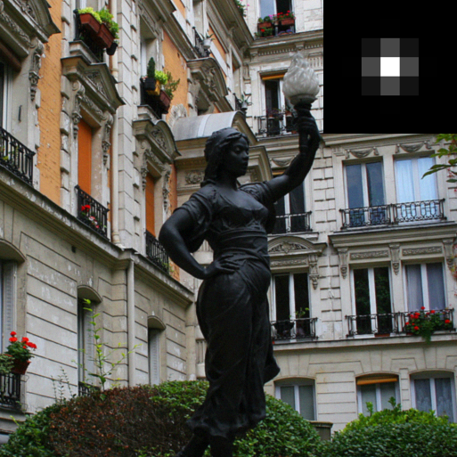 |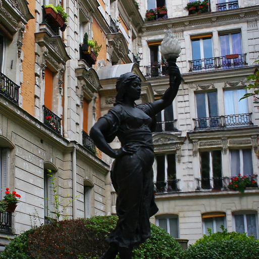|
|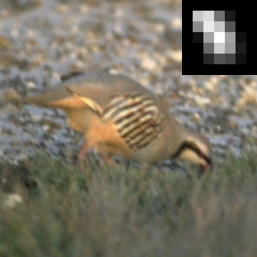 |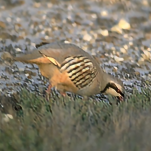|
|<i>Blur images</i>|<i>Deblurring results by ConverseNet</i>|

Visual results of Converse-USRNet
----------

|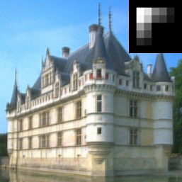 |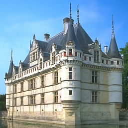|
|:---:|:---:|
|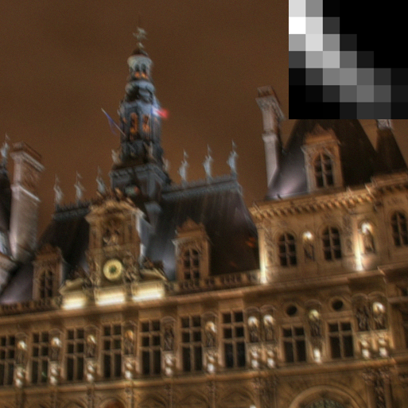 |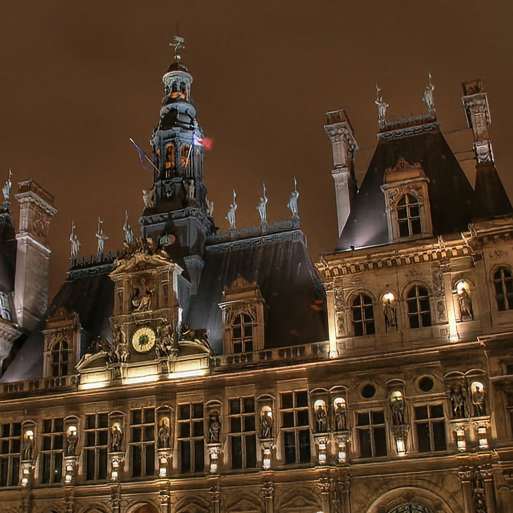|
|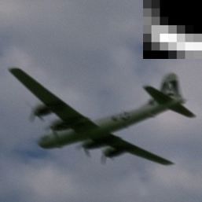 ||
|<i>Blur images</i>|<i>Deblurring results by Converse-USRNet</i>|

Acknowledgments
----------
This work was supported by Suzhou
Key Technologies Project (Grant No. SYG2024136), Natural Science Foundation of China (Grant No. 62406135), and
Natural Science Foundation of Jiangsu Province (Grant No.BK20241198).
