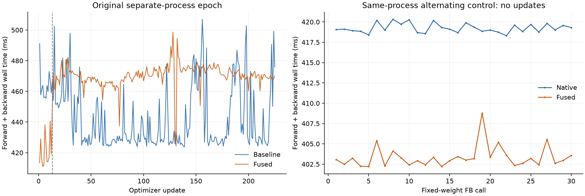

# real/crop 旧 epoch 回归定位（2026-09-27）

## 分支接入状态

本提交按用户要求将已验证的 real/crop V2 接入 `codex/nearest-phase-repair`，接在 pad commit `b80be04` 之后。main 保持不变。
接入前逐项核对 45 项 checked 源文件、5 项 Python 源、测试快照与二进制，确认与 V2 epoch 一致。提交检查仅移除 `real_crop_autograd.h` 末尾多余空行，其余源字节不变；对最终提交版重新 checked 构建，136/136 发布测试通过，FP64 记录与 V2 相同。源差异及本次构建/测试见归档中的 `landing_*` 记录；不重复训练。
旧单 epoch 负结果与后续固定权重诊断分开保留，历史触发因素未确定，不将后者改称 epoch 加速。
[版本化证据](real_crop_evidence/README.md)与[SHA256 索引](real_crop_evidence/index.json)提供下述本地 artifact 的归档副本。

## 诊断结论边界

**新的受控测量没有复现融合本身的退化。** 同进程完整模型前后向、长块连续调用、关闭 GPU 遥测、直接原始二进制 A/B/B/A 四种控制都显示约 **3%–4% 的前后向收益**。
trace 将收益定位到实际 real/crop GPU 工作减少；没有发现梯度布局变化、其它 kernel 重排或 FFT/cuDNN 路径改变的证据。

**旧 epoch 的历史触发原因仍不可追溯确认。** 可定位到候选第 13 步附近的持续前后向耗时跳变，但当时没有硬件遥测或完整时间线。
不能事后断言它来自 GPU 频率、CPU 调度、其它进程或某一个具体系统因素。旧 `110.128→116.228 秒` 的实测原样保留，不能用新的固定权重诊断改写成 epoch 加速。

本次只做诊断前后向，**没有 optimizer.step、没有模型参数或 Adam 状态更新、没有追加训练 epoch**。该轮诊断期间生产源码及 nearest-phase-repair/main 均未修改；本次接入状态见页首。

左右图纵轴范围不同；右图是固定权重诊断调用，不是新的训练轨迹。

## 1. 旧记录里慢在哪里

重新逐步核对两份原始 epoch JSON：

| 阶段 | 基线均值 ms/步 | 候选均值 ms/步 | 225 步增量 | 占训练步净回归 |
|---|---:|---:|---:|---:|
| forward/backward | 443.094 | 467.663 | +5.5280 秒 | **92.84%** |
| finite/梯度范数 | 7.178 | 8.046 | +0.1954 秒 | 3.28% |
| Adam | 9.533 | 10.485 | +0.2142 秒 | 3.60% |
| H2D | 0.226 | 0.253 | +0.0062 秒 | 0.10% |
| 步内其余开销 | 0.858 | 0.903 | +0.0103 秒 | 0.17% |
| 训练步总计 | 460.888 | 487.351 | **+5.9541 秒** | 100% |

完整 epoch 增加 6.0991 秒，其中数据准备仅约增加 0.1398 秒。因此 I/O、进度 JSON 和步外统计不是主要来源。

旧候选出现明确的分段变化：

- 前 12 步 FB 平均 **420.833 ms**，第 13–225 步平均 **470.301 ms**，增加 **11.75%**。
- 第 12/13/14 步分别约 **419.093 / 447.960 / 471.819 ms**；两段常数拟合的最小误差分界恰在第 12 步后。
- 基线方向相反：前 31 步平均 **463.655 ms**，之后平均 **439.809 ms**。
- 两组显存峰值从第 2 步起不再变化；候选跳变处没有峰值内存变化记录。
- 184/225 个候选步更慢，最大 10 个正差只占净回归约 10.49%，不是几个离群慢步造成。
- worker 没有第 13 步特殊分支，进度保存周期为 25 步。

阶段均值一起变慢不能证明统一频率缩放：候选 Adam 在前 12 步反而更慢，后面下降；各阶段逐步回归量的相关性也弱。
原 worker 每阶段前后都同步，因此不能把前一阶段未完成的 GPU 工作直接解释成 finite/Adam 的增加。
CUDA event span 仍可能包含 CPU 提交空隙，不能仅凭 wall/event 接近判定为纯 kernel 退化。

## 2. 同进程、同模型、同数据反事实对照

加载同一个已训练 checkpoint，使用第 0、12、224 号真实批次，权重固定不更新。
给 7 个实际 prior Converse2D 模块安装相同的 hook，每次 forward 共触发 35 次：

1. 取得融合输出的原生 complex IFFT base，断言它与 RealCropBackward 的唯一 next edge 指向同一个 IFFT 节点和 output slot。
2. 两组都构造同一个 `base.real[..., p:-p, p:-p]` view，保持 hook/view 构造开销对称。
3. native 组返回新构造的原生 view；fused 组返回原融合输出。
4. 输出 pointer、shape、stride、offset 均相同；全部 133 个参数梯度的字节、stride、storage offset 和 contiguous 属性均相同。

只测完整 forward/backward 与原 finite/norm 检查，不调用优化器。每次用 `zero_grad(set_to_none=True)`。
固定权重结果和原 epoch 是不同测量协议，不将数值直接混用。

| 控制 | 每臂诊断调用数 | native FB 平均 | fused FB 平均 | 配对加速比中位数/范围 |
|---|---:|---:|---:|---:|
| 6 轮交替，每组 5 次 | 30 | 419.237 ms | 403.344 ms | **1.0398×，1.0366–1.0407×** |
| 4 轮长块，每组 20 次，保留 Adam 缓冲 | 80 | 419.668 ms | 404.107 ms | **1.0408×，1.0315–1.0410×** |
| 同样长块，但完全关闭 NVML 遥测 | 80 | 见原始 JSON | 见原始 JSON | **1.0408×，1.0387–1.0424×** |

所有组都更快。长块相邻组可连续执行 40 次 fused；没有复现旧第 13 步附近约 50 ms 的持续跳变。
保留 Adam 缓冲的两组在前后独立核对模型与 Adam 张量，均完全不变。
关闭遥测的控制排除了“只有监控采样开启才显示相对收益”的解释，但不同进程绝对耗时仍不宜直接相减。

## 3. GPU trace 定位：实际节省在哪里

在首个同进程对照结束后，分别捕获一次 native/fused 的完整前后向加 finite 检查，使用 CPU+CUDA profiler；这些 trace 不参与上表计时。

| 指标 | native | fused |
|---|---:|---:|
| kernel 数 | 6,325 | 6,150 |
| kernel 时间总和/并集 | 401.015 ms | 386.042 ms |
| 首个至末个 kernel 跨度 | 442.766 ms | 429.258 ms |
| 跨度中无 kernel 的时间 | 41.751 ms | 43.216 ms |
| real/crop 收尾 kernel | 210 | 35 |
| real/crop 收尾 GPU 时间 | **21.388 ms** | **5.210 ms** |

通过 GPU External id→CPU op→SliceBackward/SelectBackward 祖先归因：准确减少 **105 个 fill + 105 个 copy**，新增 35 个融合 kernel。
收尾部分实际省 **16.178 ms**；全部 kernel 合计省 **14.973 ms**，其余工作约有 +1.205 ms 的波动。
空闲时间没有减少，因此本次 trace 中的收益应归因于 GPU 工作减少，不能宣传为消除了 CPU launch 空隙。

剔除收尾后，剩余 **6,115 个 kernel 的完整顺序及名称、grid、block、shared memory、stream 签名完全相同**，序列 SHA256 一致。
cuDNN wgrad 均为 147 次、FFT 均为 484 个 kernel、其它 full_training 均为 266 个 kernel；没有发现路径变化。
这不能替代所有内部 cuFFT plan handle 的检查，但与相同布局、相同调用和数值证据一致。

## 4. 硬件与独立二进制控制

首个交替实验按每次 FB 的 start/end 对齐 121 个 NVML 采样，排除预热、finite 和 profile：

- 两组 Pstate 均为 P0，显存频率均为 14,001 MHz。
- SM 时钟均在 **2,805–2,812 MHz**，均值分别为 2,807.410 / 2,807.217 MHz。
- 温度范围约 50–56°C；没有采样到明显降频/状态切换。
- 约 203 ms 的采样间隔不能排除瞬态，也不能用来反推旧 epoch 的硬件状态。

为排除 hook、重建 view 或候选二进制内部对照掩盖问题，另直接使用两份原始 checked 二进制，按 A/B/B/A 启动独立新进程。
没有 hook、没有 NVML，复现旧脚本的 CPU-profiler operator 预检；加载相同 checkpoint/Adam 缓冲和固定第 12 号批次，各测 20 次 FB。

| 顺序 | 原始二进制 | FB 平均 |
|---|---|---:|
| A | b80be04 基线 | 411.577 ms |
| B | real/crop V2 | 396.140 ms |
| B | real/crop V2 | 396.511 ms |
| A | b80be04 基线 | 411.893 ms |

正反配对分别为 **1.0390× / 1.0388×**。四组输出与所有参数梯度字节、梯度 stride/offset 相同，模型参数和 Adam 状态均未更新。
因此原始二进制、旧预检步骤以及没有控制 hook 的情况下，也没有复现代码固有退化。

一次最初的 B 进程在执行模型前因构建环境指纹不匹配而被拦下：同一 PowerShell 内反复初始化 MSVC 改变了环境。
改用每次独立的新 shell 后，原二进制直接通过校验；没有重编译或更改源码。失败目录与说明保留，未计入有效测量。

## 可以确认与仍不能确认

可以确认：当前环境下，融合减少了实际 GPU 工作，在受控完整模型 FB 中带来约 4% 的收益；没有发现错误 stream、梯度布局差异或非收尾 kernel 重排。
旧负结果的主要增加发生在 FB 的持续状态变化段，不能据它直接判定融合固有退化。

仍不能确认：历史第 13 步究竟由何种系统事件或运行条件触发。旧日志没有对应遥测/完整时间线，新的实验不能追溯证明某一个具体触发因素。
若需要更新正式训练性能准入，应采用同进程交错的配对训练验证。本次没有更新参数，不能取代原来的单 epoch 训练验收，也没有改写原负结果。

## 产物

- [诊断汇总](../artifacts/real_crop_diagnosis/summary.json)
- [同进程对照](../artifacts/real_crop_diagnosis/same_process/result.json) / [trace 归因](../artifacts/real_crop_diagnosis/trace_analysis.json) / [遥测分析](../artifacts/real_crop_diagnosis/telemetry_analysis.json)
- [长块、保留 Adam 缓冲](../artifacts/real_crop_diagnosis/sustained/result.json) / [关闭遥测](../artifacts/real_crop_diagnosis/no_telemetry/result.json)
- [直接基线 A1](../artifacts/real_crop_diagnosis/direct_0_native/result.json) / [候选 B1](../artifacts/real_crop_diagnosis/direct_1_fused_fresh/result.json) / [候选 B2](../artifacts/real_crop_diagnosis/direct_2_fused_fresh/result.json) / [基线 A2](../artifacts/real_crop_diagnosis/direct_3_native_fresh/result.json)
- [同进程诊断脚本](../tools/diagnose_real_crop.py) / [直接二进制脚本](../tools/diagnose_real_crop_direct.py)
- [原始 epoch 报告](training_real_crop_2026-09-27.md)，其结果保持不变。

每个诊断目录保存运行时脚本快照和 checked manifest；sustained 的说明字段曾沿用“No optimizer exists”模板，已仅修正为“保留 Adam 缓冲但不更新”，原 JSON 与 SHA256 同目录保留，测量数据未改。
