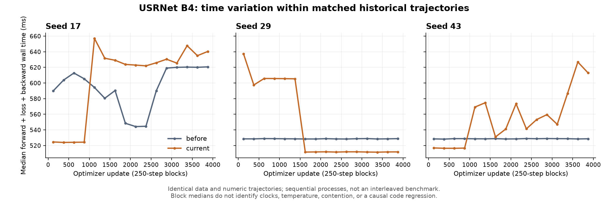

# 完整训练时间去了哪里

本轮先审计上一轮已有的六条 4000 更新轨迹，再用冻结的训练程序做交错顺序的短流程诊断。历史数据仍是“完整训练未加速”；新诊断不能覆盖或改写这一结果。

## 历史流程的匹配账本

每个种子的 before/current 都是相同的 4000 个数据步、相同初始化和训练配方，loss、梯度范数、17 次完整验证及终点状态一致。审计绑定原始文件 SHA，检查逐行计时和累计计时相符。seed43 保留原 failed session 的 3000 步，再加恢复 session 的 1000 步及全部进程成本。

下面是 current 减 before，单位秒；正值表示 current 多花时间。各列互斥，最后一列等于前六列之和。

| Seed | 初始化（扣初始保存） | 数据准备/哈希 | 训练步 | 评估主体 | 全部保存 | 未归因余量 | 进程总差 |
|---:|---:|---:|---:|---:|---:|---:|---:|
| 17 | -0.746056 | +0.650353 | +22.087623 | -11.968693 | -0.004990 | +0.468812 | +10.487048 |
| 29 | +0.256877 | +0.045208 | +74.969736 | -8.813913 | -0.029753 | -1.621792 | +64.806362 |
| 43 | -2.818818 | +7.874579 | +143.087675 | -7.599282 | -0.029572 | +0.816796 | +141.331378 |

训练步内部再展开如下。它们已包含在上表训练步中，不能再加到进程总时间。

| Seed | H2D | forward + loss + backward | 有限性/梯度范数检查 | Adam | 步内未归因余量 |
|---:|---:|---:|---:|---:|---:|
| 17 | +0.066908 | +18.593408 | +2.019801 | +1.407171 | +0.000335 |
| 29 | +0.030068 | +73.598767 | +0.685922 | +0.793986 | -0.139007 |
| 43 | +0.108968 | +132.268526 | +5.053926 | +5.344366 | +0.311888 |

主要新增时间落在 forward/loss/backward，评估节省了一部分时间。数据准备对 seed43 有额外约 7.87 秒影响，但不是主体；保存不到 1 秒，不能解释训练流程差额。

## 计时边界与能解释到哪一步

- 原 worker 在各训练子阶段前后显式同步；子阶段是顺序 wall 范围。CUDA event span 含 CPU 提交间隙与等待，不能当作 GPU kernel busy 时间，也不能与 wall 再相加。
- 数据部分是同步的 CPU 读取、退化、检查和哈希；没有异步 DataLoader，不能把这列改称“异步数据等待”。H2D 在训练步内独立记录。
- initial checkpoint 位于 setup 计时内。因此先从 setup 扣除 initial checkpoint，再完整计入所有 checkpoint，避免重复。
- evaluate 的内部 body 不包括入口参数检查、cache 清理及退出清理；这些与日志、JSON 写入、未单列检查一起留在未归因余量，不强行归为 CPU 或 GPU 开销。
- process 从 worker 的 `main()` 开始，包含其后的模型/库准备；不包含解释器启动、进入 main 之前的模块导入以及最后一次 report 写入。外层 PowerShell/亲和性探针是另一范围。
- seed43 失败到恢复的 282.197191 秒事件间隔独立保留，不加入这组进程计时；恢复重复 setup/initial checkpoint 则按实际发生的成本计入。

每 250 步的相同数据区间中，快慢关系会改变。例如 seed29 的前 1500 步 current/before 前反向中位比约 1.13–1.21，后 2500 步约 0.968。没有统一的固定回归比例。历史运行是先后启动的不同进程，缺少与每个区间对应的频率、温度和竞争遥测；这张账本只能确定时间在哪一阶段，不能把变化单独归因于代码、GPU 温度或 CPU 调度。



图中的点是相应 250 步的中位数，横轴是更新编号而非运行时刻。不同种子的工作量按本种子匹配，不跨种子平均掩盖差额。其源报告为 `artifacts/training_followup/training_time_v1.json`。

## 新的交错短流程对照

在相同 checked 源码/二进制、冻结 worker 和亲和性 `0xC03C03` 下，新建八个进程，顺序固定为 **ABBA/BAAB**，A=before、B=current。全部从同一预训练状态开始，seed17、真实 B4/micro4、HR96/s3、确定性 FP32、Adam 1e-5 不变。每进程执行相同的 64 个数据更新，在 0/32/64 步各完整评估 100 张固定验证图，并保存 checkpoint；不使用 profiler。只读 `nvidia-smi` 以 1 Hz 记录 GPU 状态，不设置频率、功耗或其他进程。

八次均正常完成。按数据步匹配，64 个 loss 和梯度范数、三次逐图及汇总指标全部相同；最终 133 个模型张量、399 个 Adam 张量逐字节相同，结构和标量一致。每个 variant 的生产源码和 checked build 都与历史冻结身份相符。审计只在进程退出后读取文件，并核对逐行与累计 timer、实际/子进程亲和性。

下表比例为 before/current，>1 表示 current 更快。四组配对全部保留，不选择最优一组。

| 配对进程 | before process 秒 | current process 秒 | 全部训练步加速比 | process 加速比 |
|---|---:|---:|---:|---:|
| 01_before / 02_current | 51.458718 | 48.998788 | 1.020311× | 1.050204× |
| 04_before / 03_current | 51.726689 | 49.801990 | 1.007974× | 1.038647× |
| 06_before / 05_current | 52.201994 | 49.192714 | 1.031134× | 1.061173× |
| 07_before / 08_current | 56.865805 | 53.185628 | 1.039466× | 1.069195× |

全部训练步的配对比中位数为 **1.025722×**；明确去掉每个进程前五步的 warmed 诊断中位数为 **1.028552×**，但完整流程和全部训练步表均保留这些成本。前向/loss/backward 的中位比为 **1.027263×**。评估主体比值为 1.1966–1.2402×，与现有推理路径有收益的方向一致；本对照并未单独隔离评估中的各组件，不能将整段改善全部归于 LayerNorm。

process 中位比 **1.055689×** 仅适用于这个 64 更新、三次评估的诊断流程。其评估密度远高于原 4000 更新、17 次评估，因此不能外推成长训练同幅收益。外层 wrapper 时间另记，包含 PowerShell 环境、亲和性探针与解释器启动，不与 process 再相加。

这组短测支持当前包有小幅训练步收益，但仍观察到不同进程的时间变化；固定亲和性也没有消除所有波动。它不能复原历史慢区间当时的频率/温度/竞争状态，不能将长流程差额直接判为代码退化，也不能据短流程宣布长训练已加速。历史长流程未获收益与当前短诊断的小幅收益必须同时保留。

原始八次运行、完整遥测、`training_pairs_audit_v1.json` 均保存在 `artifacts/training_followup/`。已测 runner/auditor 源码快照与当时报告 SHA 相符；当前工具只将说明文字中的固定步数改为实际参数，计时和数值逻辑未变。

## 复现

```powershell
.venv/Scripts/python.exe -B tools/training_followup/audit_training_time.py --output artifacts/training_followup/training_time_replay.json
.venv/Scripts/python.exe -B -m unittest discover -s tools/training_followup -p test_audit_training_time.py -v
.venv/Scripts/python.exe -B tools/training_followup/run_training_pairs.py --output artifacts/training_followup/training_pairs_NEW --steps 64
.venv/Scripts/python.exe -B tools/training_followup/audit_training_pairs.py artifacts/training_followup/training_pairs_NEW --output artifacts/training_followup/training_pairs_audit_NEW.json
```

四个 CPU 测试覆盖重复计费、非法父子时间范围、数据/状态不匹配与缺步；第二人独立重算七个 session 和三组配对账本，与报告完整相同。原训练程序、原始失败记录和旧报告没有改动。
